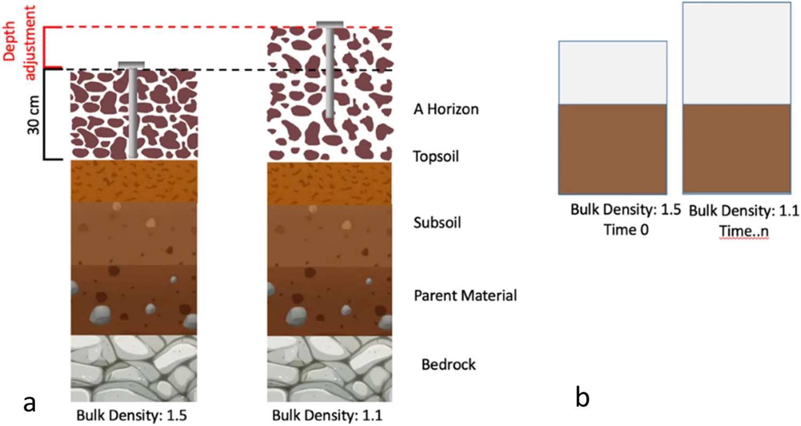
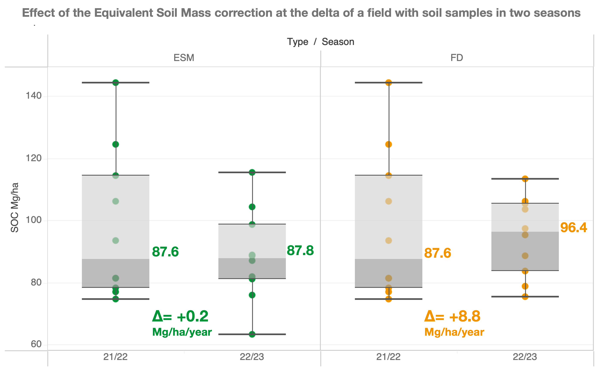

### Correct Carbon Stock using Equivalent Soil Mass (ESM) in R and/or Python

---

##### SOC_ESM_Calculations

This repository provides tools for **Equivalent Soil Mass (ESM)** and the traditional method **Fixed Depth (FD)** calculations to analyze **Soil Organic Carbon (SOC)** data. The implementations in Python and R are based on the methodology described in:

> Haden et al., 2020, "Soils' dirty little secret: Depth‐based comparisons can be inadequate for quantifying changes in soil organic carbon and other mineral soil properties". [Link](https://onlinelibrary.wiley.com/doi/pdf/10.1111/gcb.15124https:/)

---



**Figure 1.** (**a**) Example of pedon alteration due to changes in bulk density over time showing the position of the soil sampling device from the soil surface to the same fixed depth. (**b**) Example of pedon after the correction showing the difference in air space, while the soil mass remains constant (ESM method). [source](https://www.nature.com/articles/s41598-023-29289-2)




**Figure 2**. Delta calculation using the cumulative median of SOC in Mg/ha [0-30cm] for Example 1 dataset (1 field, 10 soil samples, 2 seasons, 3 depthes). The ESM corrects the overestimation by 8.6 Mg/ha/year compared to FD.

---


## Features

- **Python Implementation**:
  - Interactive Jupyter Notebook (`.ipynb`) for calculations.
  - Example input and output datasets.
- **R Implementation**:
  - Scripts and example datasets for ESM calculations using R.
- Support for reproducibility with input/output examples and supplementary data.
- Multiple examples:
  - `Haden-2020-supinfo.xlsx`: Example input for standard paired comparisons.
  - `example1_multi_grower_field_to_calculate_stock_INPUT.xlsx`: Example input for multiple fields, seasons, and temporal paired analysis.

---

## Getting Started

### Prerequisites

#### Python Environment

- **Version**: Python >= 3.9.6
- **Required Libraries**:
  - `pandas`
  - `numpy`
  - `matplotlib`
  - `scipy`
  - `tqdm`

Install dependencies with:

```bash
pip install -r requirements.txt
```

#### R Environment

* **Version** : R >= 4.3.1
* **Required Packages** :
  * `openxlsx`
  * `dplyr`
  * `tidyr`

Install the required R packages:

```R
install.packages(c("openxlsx", "dplyr", "tidyr"))
```

##### Folder Structure

```
/
|-- assets/
|   |-- images/                     # Placeholder for images
|-- Paper/
|   |-- Haden-2020-Paper-Soils' dirty little secret.pdf
|   |-- Haden-2020-R Script.pdf     # Original Supporting R documentation
|-- SOC_ESM_Haden_2020_Python/
|   |-- Haden-2020-ORIGINAL-Bayer-Carbon-Python.ipynb
|   |-- Haden-2020-supinfo.xlsx     # Example 1: input file for standard paired comparisons
|   |-- example1_multi_grower_field_to_calculate_stock_INPUT.xlsx  # Exemple2: Multi-field, multi-season example 
|   |-- example1_multi_grower_field_to_calculate_stock_OUTPUT.xlsx # Example2: Output 
|   |-- FD_ESM_carbon_OUTPUT.xlsx # Example1: Output
|-- SOC_ESM_Haden_2020_R/
|   |-- Haden-2020-supinfo.xlsx     # Example input file for standard paired comparisons
|   |-- example1_multi_grower_field_to_calculate_stock_R_OUTPUT.xlsx # Example2: Output
|   |-- FD_ESM_R_output.xlsx # Example1: Output
|   |-- Haden-2020-R Script.R # Main R Script (The original Script of Haden et al. 2020). 
|-- requirements.txt                # Python dependencies
|-- CODEOWNERS                      # Repository maintainers
|-- README.md                       # Project documentation

```

---

## How to Clone this Project

1. **Option 1 (Visual Studio Code)** [[Download](https://code.visualstudio.com/download)]:

* Open Visual Studio Code.
* Go to **Source Control** (Ctrl+Shift+G or Cmd+Shift+G).
* Click on **Clone Repository** and paste the URL:

```
https://github.com/username/SOC_ESM_Calculations.git
```

Choose a directory where the project will be saved, and VS Code will automatically open it.

2. **Option 2 (Terminal)** :
   Clone the repository using the terminal:

```
git clone https://github.com/username/SOC_ESM_Calculations.git
cd SOC_ESM_Calculations
```

---

## How to Use

1. **Python** :
   * Open`Haden-2020-ORIGINAL-Bayer-Carbon-Python.ipynb` in Jupyter Notebook.
   * Use:
     * `Haden-2020-supinfo.xlsx` for standard paired comparisons.
     * `example1_multi_grower_field_to_calculate_stock_INPUT.xlsx` for multi-field and temporal paired analysis.
   * Run the notebook to generate and export the results.
2. **R** :
   * Open`Haden-2020-R Script.R` in RStudio.
   * Use`Haden-2020-supinfo.xlsx` as the example input dataset.
   * Modify the script as needed for your dataset.
   * Run the script to generate and export the results.

---

## Citation

If you use this repository in your research, please cite the appropriate sources:

1. **Using the R/Python Scripts** :
   * Cite the original paper:
     > von Haden, A. C., Yang, W. H., & DeLucia, E. H. (2020). Soils' dirty little secret: Depth‐based comparisons can be inadequate for quantifying changes in soil organic carbon and other mineral soil properties. *Global Change Biology* , *26* (7), 3759-3770.Haden et al., 2020, *"Soils' dirty little secret.*
     >
   * Additionally, cite this repository:
     > *SOC_ESM_Calculations repository.* Correct Carbon Stock using Equivalent Soil Mass (ESM) in R and/or Python.[GitHub Repository URL]
     >
